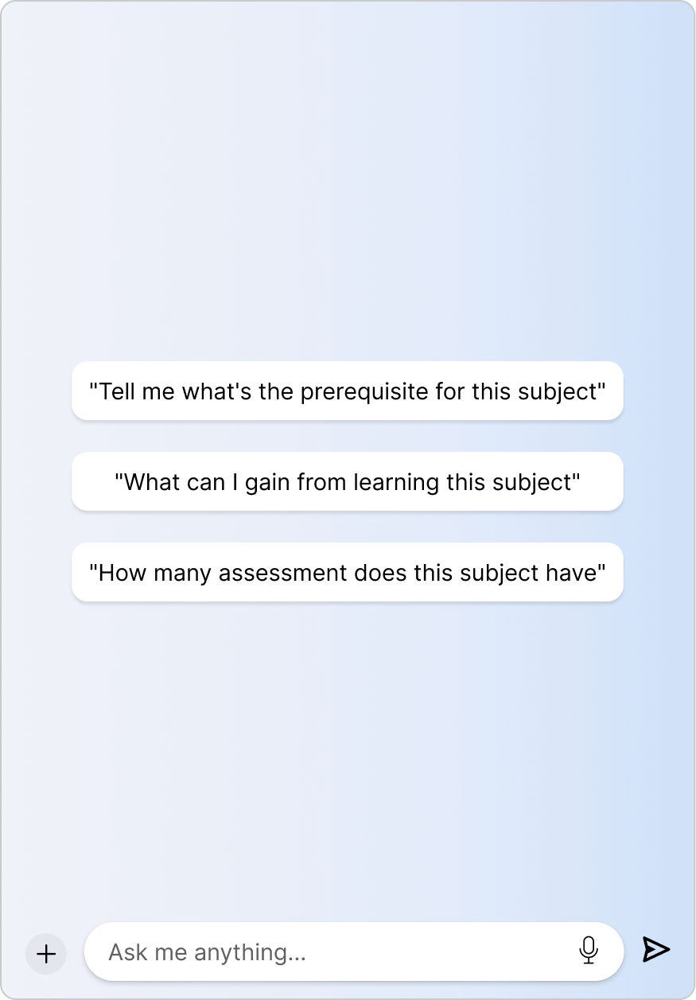
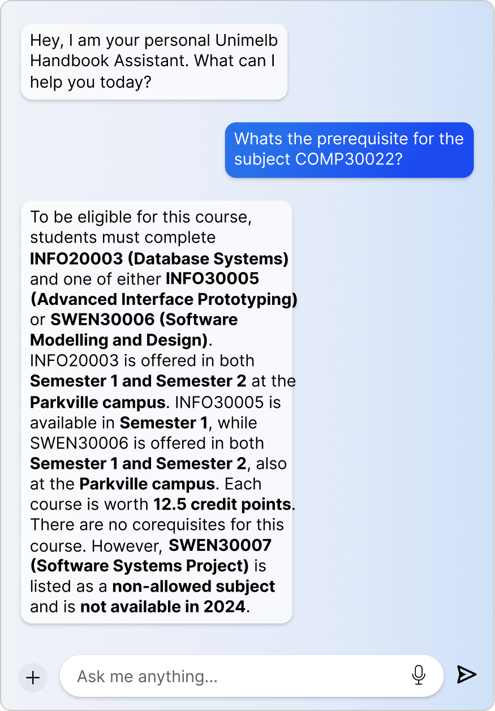

# Unimelb Handbook Chatbot


<p align="center">
  
  
</p>

This is a chatbot built with Next.js, Vanna, and Azure Speech Services. It allows users to ask questions about the University of Melbourne handbook and receive responses.

## Getting Started

### Installation

1. Clone the repository:
   ```bash
   git clone https://github.com/your-username/unimelb-handbook-chatbot.git
   ```

2. Install dependencies:
    ```bash
    npm install
    npm install pnpm
    ```

3. Install the requirements for the flask api
    ```bash
    pip install -r requirements.txt
    ```   

### Add environment variables

1. Create a `.env` file in the root of the project

2. Add the following environment variables to your `.env` file:
    ```bash
    OPENAI_API_KEY=<your-openai-api-key>
    AZURE_SPEECH_KEY=<your-azure-speech-key>
    VANNA_API_KEY=<your-vanna-api-key>
    ```

### Running the Application

1. Start the development server:

    ```bash
    npm run dev
    ```

2. Try the [demo page](http://localhost:3000/) or if you wanna train the model, access [api page](http://localhost:5328/), and go to training data page

  > [!IMPORTANT]
  > you must *either* use the demo page or the api page
